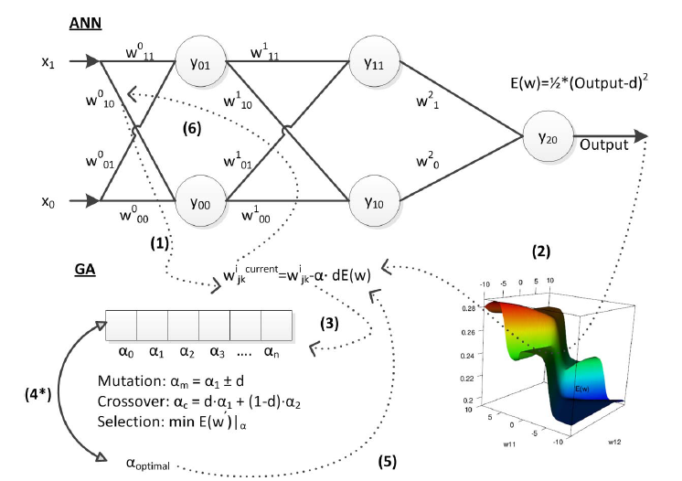

# ANNStream

Evolutionary optimization of on-line multilayer perceptron for similarity-based access control

# Access control as data streasm learning problem

Conventional Multilayer Perceptron training is not efficient whendealing with data streams such that access patterns flow sincethe availability of the data samples is limited. Considering this obstacle I proposed to use Genetic Algorithm as meta-heuristicoptimization in selection of individual training rates 'alpha' for each weight. Similarity-based Access Control mechanism deals with a data stream that includes continuous flow of attributescharacterizing user and resources, so the task is to estimate thelikelihood of legitimacy of user accessing a particular resourcein dynamic environment. This research contributes to the fiel dof Information Security by overcoming the limitations of datastream mining in agile environment.

## Original Paper

You can find more information about the practical experiments and datasets in the following conference paper:

    @inproceedings{shalaginov2017evolutionary,
  	title={Evolutionary optimization of on-line multilayer perceptron for similarity-based access control},
	author={Shalaginov, Andrii},
	booktitle={2017 International Joint Conference on Neural Networks (IJCNN)},
	pages={823--830},
	year={2017},
	organization={IEEE}
	}

## Dataset

The orginal dataset that was used for this task is Amazon.com - "Employee Access Challenge": https://www.kaggle.com/c/amazon-employee-access-challenge
Corresponding pre-procesed files are train.txt and test.txt

## Requirements:

- g++ (tested on v. 4.7.3 and higher)
- STL containers for data operations
- OpenMP for parallel execution (v. 3.1 and higher)

## Misc

There is also a possibility to limit a number of execution threads through variable 'maxThreads'

## Experimental CUDA implementation

main.cu - work in progress

